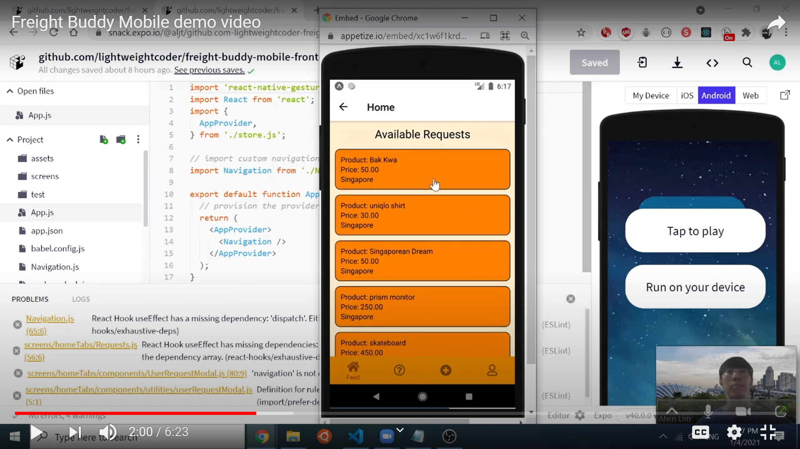
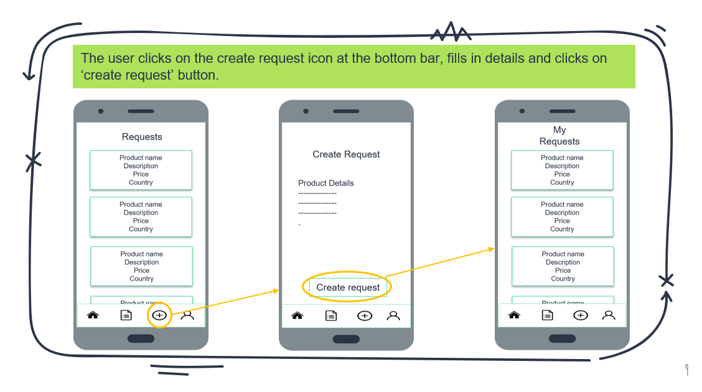
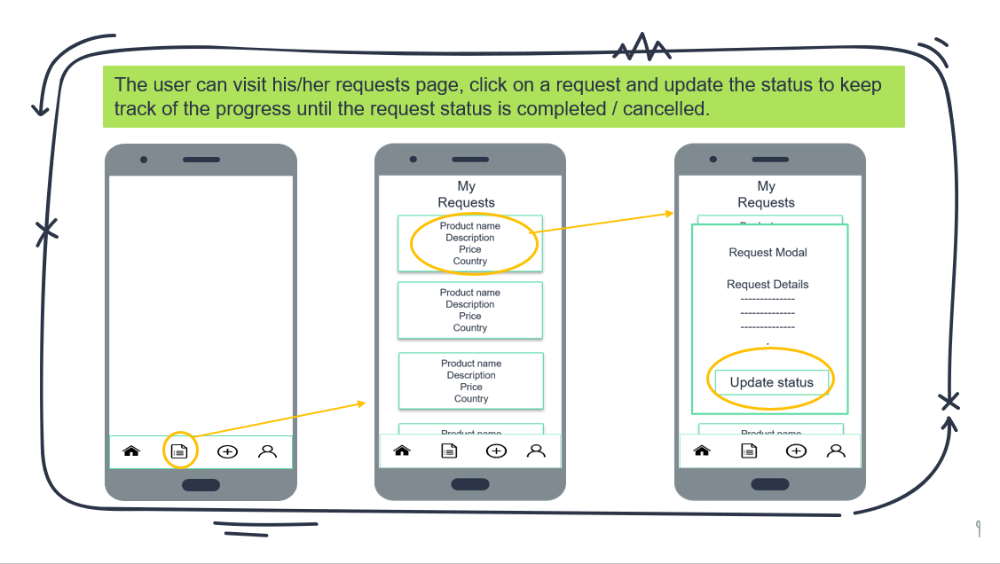
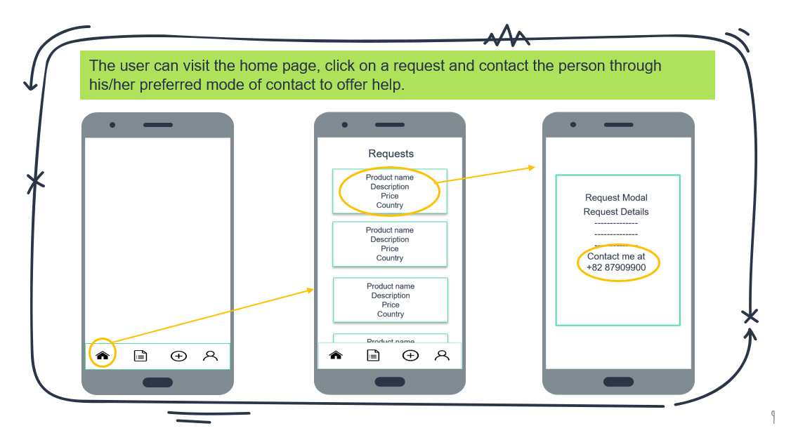

# Freight Buddy Mobile Front-end

Rocket Academy SWE1 Project 6

## [Go to App](https://snack.expo.io/@aljt/lightweightcoder_freight-buddy-mobile-frontend)

## Technologies used

- Front-end framework: React Native
- AJAX: Axios
- Other technologies: Github, Expo

## About

An app that allows people (requesters) to enlist the help of others (helpers) overseas to purchase products from those overseas countries and ship them to the requesters' country.

## Demo Video on how to use Freight Buddy Mobile

Click the gif below to view the demo of freight buddy

## User Stories

1. A user can enlist the help of someone overseas to buy an product and ship it over to the user.
   
   

2. The user can help other fulfill their request to earn money.
   

## [Project Portfolio Site](https://lightweightcoder.github.io/portfolio/freight-buddy-mobile.html)

## [Back-end Repository](https://github.com/lightweightcoder/freight-buddy-mobile-backend)
